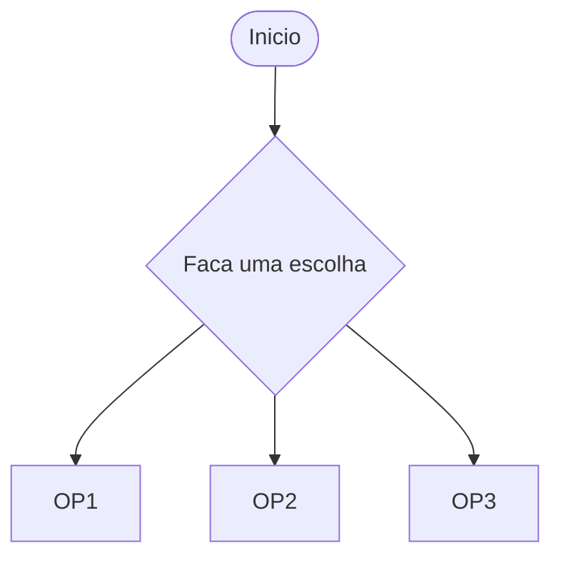
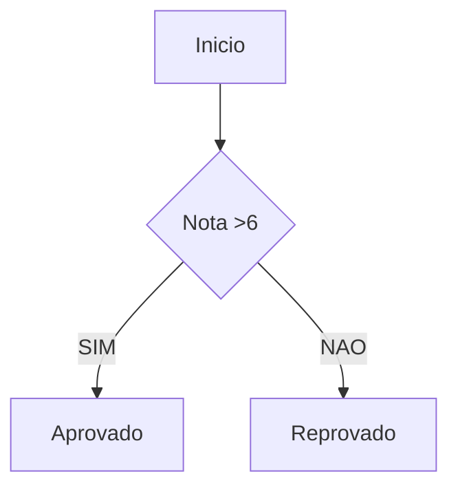
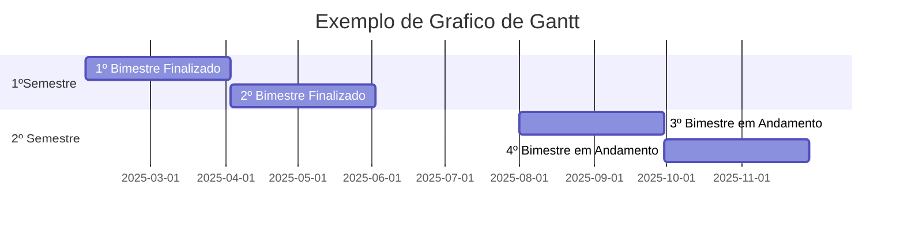
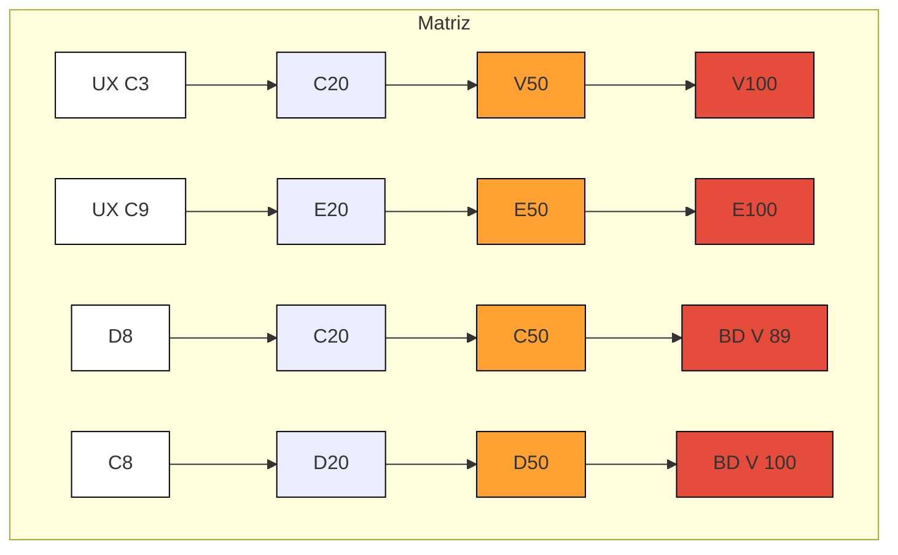

# Grafico-Gannt

```mermaid
flowchart TD
 
A(["Inicio"])
A --> B{"Faca uma escolha"}
B --> C["OP1"]
B --> D["OP2"]
B --> E["OP3"]
```
 

```mermaid
graph TD;
A[Inicio] --> B{Nota >6};
B --> |SIM| C[Aprovado];
B --> |NAO| D[Reprovado];
```

```mermaid
gantt
  title Exemplo de Grafico de Gantt
  dateFormat YYYY-MM-DD
  section 1ºSemestre
  1º Bimestre Finalizado:a1, 2025-02-02, 60d
  2º Bimestre Finalizado:a2, after a1, 60d
  section 2º Semestre
  3º Bimestre em Andamento: a3, 2025-08-01, 60d
  4º Bimestre em Andamento: a4, after a3, 60d
```

```mermaid
graph TD
   subgraph Matriz
A1["UX C3"]:::branco --> A2["C20"]:::amarelo --> A3["V50"]:::laranja --> A4["V100"]:::vermelho
B1["UX C9"]:::branco --> B2["E20"]:::amarelo --> B3["E50"]:::laranja --> B4["E100"]:::vermelho
C1["D8"]:::branco --> C2["C20"]:::amarelo --> C3["C50"]:::laranja --> C4["BD V 89"]:::vermelho
D1["C8"]:::branco --> D2["D20"]:::amarelo --> D3["D50"]:::laranja --> D4["BD V 100"]:::vermelho

end
classDef branco fill:#fff, stroke:#000, stroke-width:1px;
classDef amarelo fill:#FFD8D, stroke:#000, stroke-width:1px;
classDef laranja fill:#FFA233, stroke:#000, stroke-width:1px;
classDef vermelho fill:#E64C3C, stroke:#000, stroke-width:1px;
```
